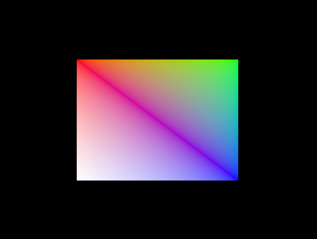
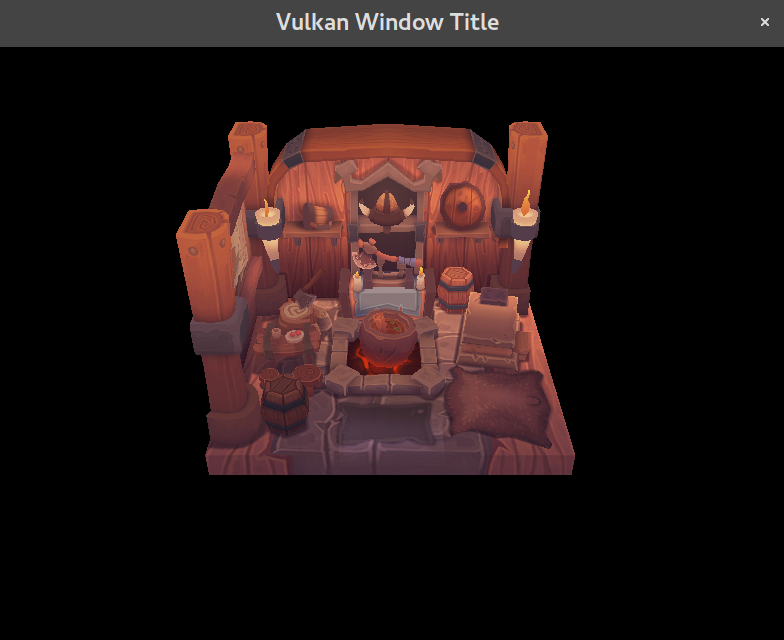

# vulkan showcase
Vulkan Showcase

A well documented (i know ... that's what I hope for at least) vulkan tutorial
code base.

Here is the color gradient. It can be obtained around the commit #24f04d8.

Here is the mesh. It should be the current output of the master's branch.

# Plans

Vulkan currently imposes two ways of constructing any meaningful code:

- Monolithic blob of rendering machinery tailored for specific use case.

- Monolithic blob of rendering machinery not tailored for anything.

My goal is to write utility functions around vulkan objects and compose them
with reasonable defaults around applications. Anything that can be generated
at the compile is to be refactored into templates.

The strategy for doing that is to first dissect the implementation of the
`hellotriangle.hpp` into several files and fill the method calls with utility
functions and their default values.

# Contributing

* Help documenting the code.
* Translate already documented code.
* [Buy me a coffee ](buymeacoffee.com/vivalambda)
